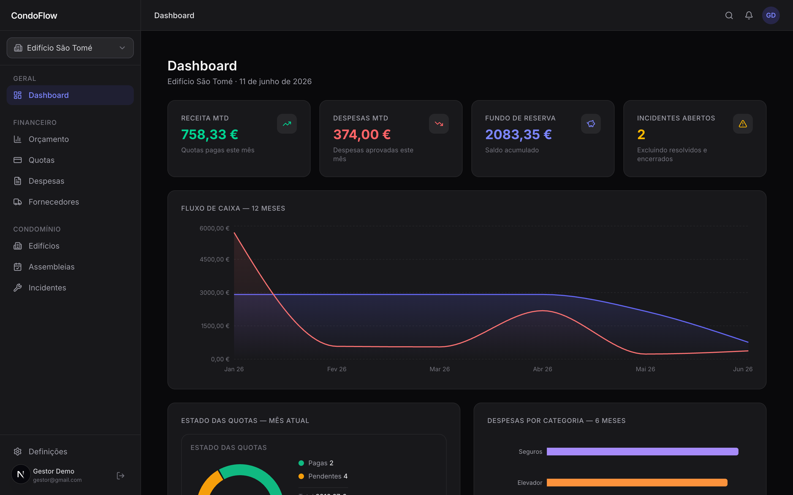
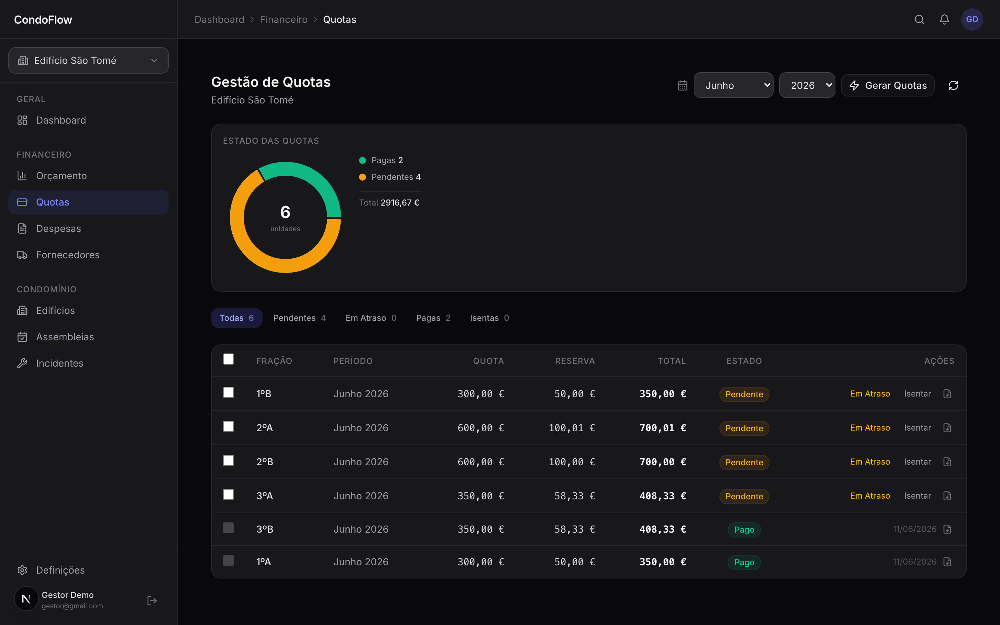
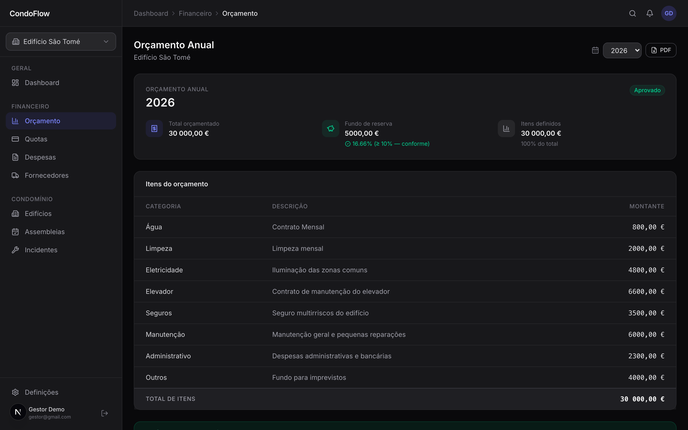
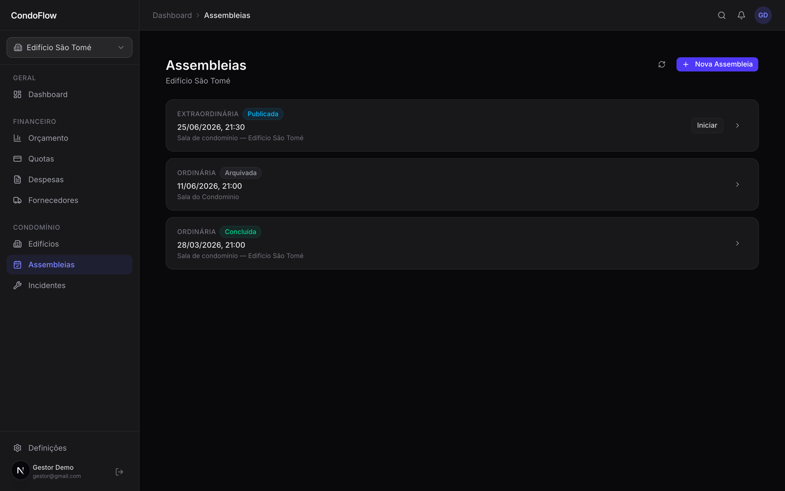
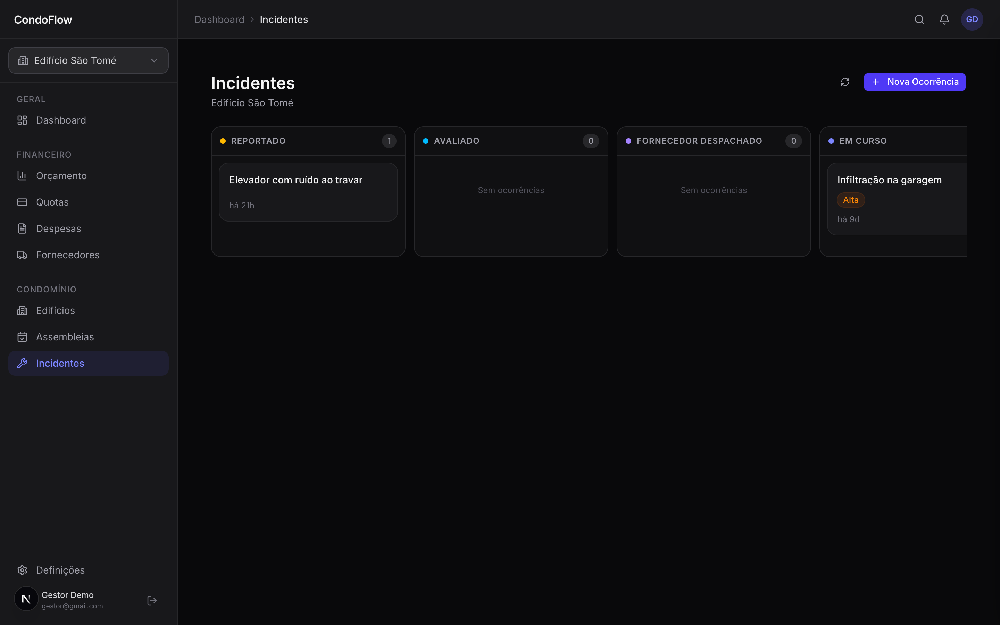
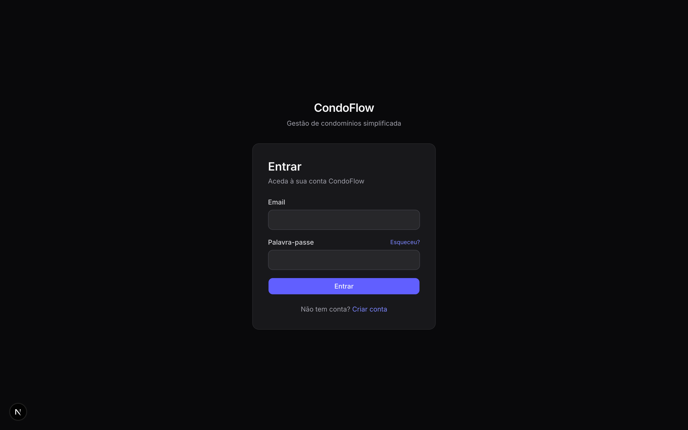

<div align="center">

# 🏢 CondoFlow

**Multi-tenant SaaS for Portuguese condominium management**

Full-stack platform for Gestores de Condomínio and Condóminos — financial ledger, digital assemblies with weighted voting, incident tracking, and automated notifications. Built to align with Portuguese horizontal property law (DL 268/94).

[](https://nextjs.org)
[](https://www.typescriptlang.org)
[](https://supabase.com)
[](https://tailwindcss.com)
[](https://react.dev)

<br>



</div>

---

## ✨ What it does

CondoFlow runs the full operational life of a residential building, end to end:

| | |
|---|---|
| 💶 **Financial ledger** | Annual budgets with a legally mandated 10% reserve-fund floor, automated monthly quota generation weighted by *permilagem* (per-mille ownership share), payment tracking, and overdue sweeps |
| 🗳️ **Digital assemblies** | Full assembly lifecycle (draft → published → in progress → concluded), agenda management, *permilagem*-weighted voting with proxy support, immutable vote records, and formal *ata* (minutes) export to PDF |
| 🧾 **Expenses & suppliers** | Invoice upload with OCR-ready document pipeline, approval workflow, supplier registry with soft-delete |
| 🔔 **Notifications** | 7 event triggers across in-app (Supabase Realtime) and email channels, per-user per-building preference matrix, scheduled Edge Function for overdue reminders |
| 🛠️ **Incident Kanban** | Residents report issues; managers triage them across a four-column board with priorities, tickets, and audit-trail timelines |
| 📊 **Analytics & reports** | Cash-flow charts, reserve-balance tracking via SQL window functions, quota status donuts, and A4 PDF exports (receipts, budget reports, expense reports) |
| 🛡️ **Admin & compliance** | SuperAdmin portal with platform-wide KPIs, append-only session/audit logs, and a GDPR Art. 17 erasure workflow that anonymises PII while preserving accounting integrity |

---

## 📸 Screenshots

| Quota management | Annual budget |
|:---:|:---:|
|  |  |

| Assemblies | Incident Kanban |
|:---:|:---:|
|  |  |

<div align="center">



</div>

---

## 🏛️ Engineering highlights

The interesting part of this project is less the feature list and more the invariants it enforces:

**Money is integer cents, everywhere.**
No `FLOAT`, no `parseFloat`, no `toFixed()` in any financial path. A single inbound conversion point (`decimalToCents`, backed by `decimal.js` to dodge IEEE 754 drift on inputs like `1.005`) and a single outbound formatter (`formatCurrency`, `pt-PT` locale). Quota generation distributes rounding remainders to the highest-*permilagem* unit so collected totals always equal the budget **exactly** — verified by a 73-case Vitest suite.

**The database defends itself.**
Row-Level Security on all 21 tables, but RLS alone isn't trusted: state machines (quota lifecycle, assembly lifecycle, expense approval) are enforced by `BEFORE` triggers that fire **even for the service role**. The audit log and vote records are append-only at the Postgres level — no API bug can rewrite history. The 10 000‰ per-building ownership constraint is serialised with `FOR UPDATE` to survive concurrent edits.

**Multi-tenancy without trust.**
`building_id` is always derived server-side from the session and FK chains — never read from the client. Condómino queries are scoped to `unit_ownership` rows tied to the session user, so no parameter manipulation can expose another building's data. Every mutation lives in a server action with a `requireRole` guard and writes a before/after snapshot to the audit log.

**Secrets can't reach the browser.**
Email adapters and privileged Supabase clients import `"server-only"` — the bundler fails the build if a client component ever imports them. CSP, rate limiting on auth routes, and Zod validation on every API handler round out the hardening pass.

**Legal compliance as code.**
The 10% reserve-fund minimum (DL 268/94, Art. 4.º) is checked with integer math (`reserve * 10 >= total`) in both the server action and the UI. Votes snapshot the unit's *permilagem* at cast time, so historical tallies stay correct after ownership changes. GDPR erasure redacts PII fields without touching financial records.

---

## 🧰 Tech stack

| Layer | Technology |
|---|---|
| Framework | **Next.js 16** (App Router, Server Actions, Route Handlers) |
| Language | **TypeScript** — strict mode, zero `any` / `@ts-ignore` in `src/` |
| Backend | **Supabase** — Postgres, Auth, Storage, Realtime, Edge Functions |
| Styling | **Tailwind CSS v4** (CSS-first `@theme`), dark-mode-first |
| UI | shadcn/ui (`@base-ui/react`), lucide-react, recharts |
| Forms & validation | react-hook-form v7 + Zod v4 |
| Rich text | Tiptap (assembly minutes editor) |
| PDF | @react-pdf/renderer (server-only) |
| Testing | Vitest |

---

## 👥 Roles

| Role | Scope |
|---|---|
| **SUPERADMIN** | Platform-wide — building registry, user management, KPIs, GDPR queue |
| **GESTOR** | Full management of their assigned buildings — budgets, quotas, assemblies, expenses, incidents |
| **CONDÓMINO** | Their own units — payments view, voting, incident reporting, notification preferences |

Role-based access is double-enforced: a 48-action permission matrix in the app layer, and RLS policies per table in Postgres.

---

## 🚀 Getting started

```bash
# 1. Install dependencies
npm install

# 2. Copy the environment template and fill in your Supabase credentials
cp .env.local.example .env.local

# 3. Apply migrations to your Supabase project
npx supabase db push

# 4. Generate TypeScript types from the applied schema
npx supabase gen types typescript --project-id <your-ref> --schema public \
  > src/lib/supabase/types.ts

# 5. Run the development server
npm run dev
```

Open [http://localhost:3000](http://localhost:3000).

```bash
npm run test:run    # Vitest suites (permilagem + currency engines)
npm run typecheck   # tsc --noEmit
npm run lint        # ESLint
```

---

## 🗂️ Project structure

```
src/
├── app/
│   ├── (auth)/          # Login, register, password recovery
│   ├── (dashboard)/     # Gestor dashboard + Condómino "my building" area
│   ├── (marketing)/     # Public pages
│   ├── actions/         # All server actions (auth, budgets, quotas, assemblies, …)
│   └── api/             # PDF export Route Handlers
├── components/          # Charts, finance widgets, layout, shadcn primitives
├── contexts/            # User, Building, Notification (Realtime) contexts
└── lib/
    ├── auth/            # Permission matrix (client-safe) + role guards (server-only)
    ├── finance/         # Permilagem engine + test suite
    ├── notifications/   # Typed email layer (Resend/Postmark adapters), triggers
    ├── pdf/             # A4 templates: receipts, budget & expense reports
    └── utils/           # Integer-cents currency utilities + test suite

supabase/
├── functions/           # Edge Functions: overdue-quota-sweep (scheduled cron)
└── migrations/          # 11 migrations — schema, RLS, triggers, views
```

A detailed development log lives in [`CHANGELOG_TECHNICAL.md`](./CHANGELOG_TECHNICAL.md).

---

## 📌 Status

All nine development phases are complete — foundations, auth & RBAC, financial ledger, expenses, notifications, assemblies, incidents, analytics, SuperAdmin portal, and GDPR/security hardening.

<div align="center">

*Built as a portfolio project exploring multi-tenant architecture, financial-grade data integrity, and database-enforced invariants.*

</div>
